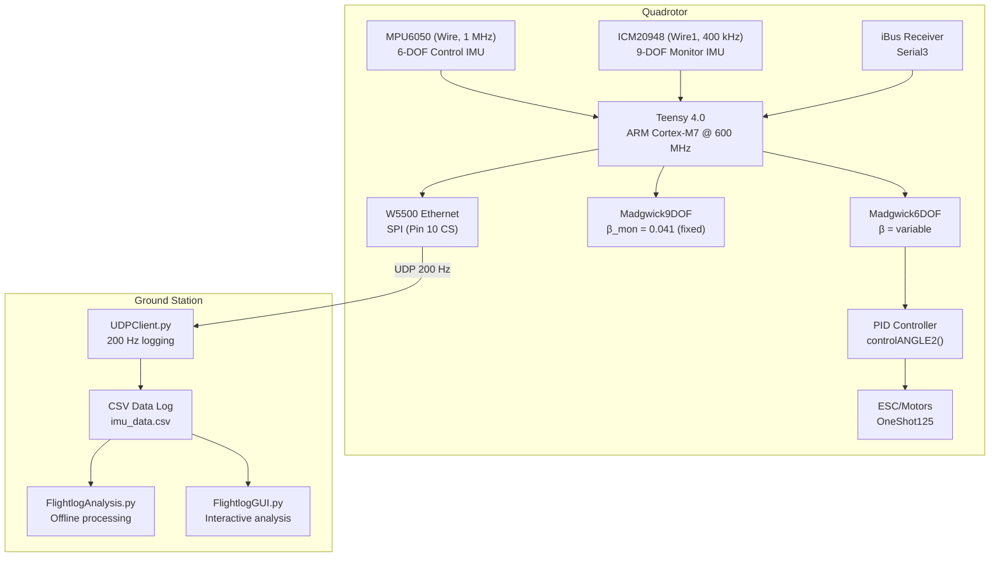
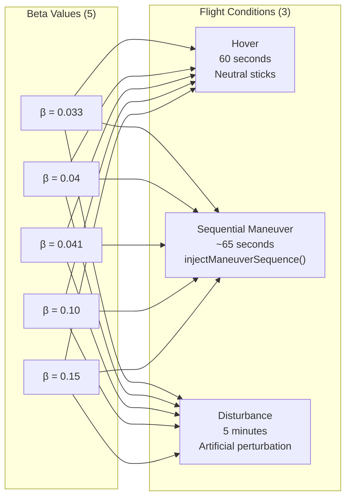
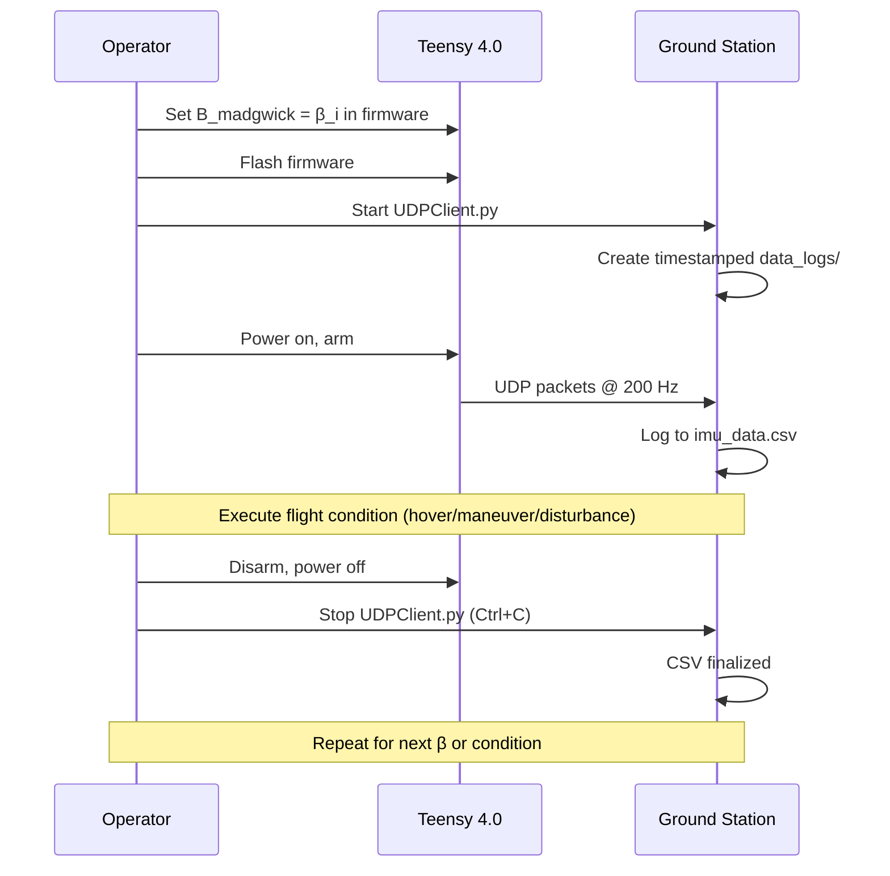
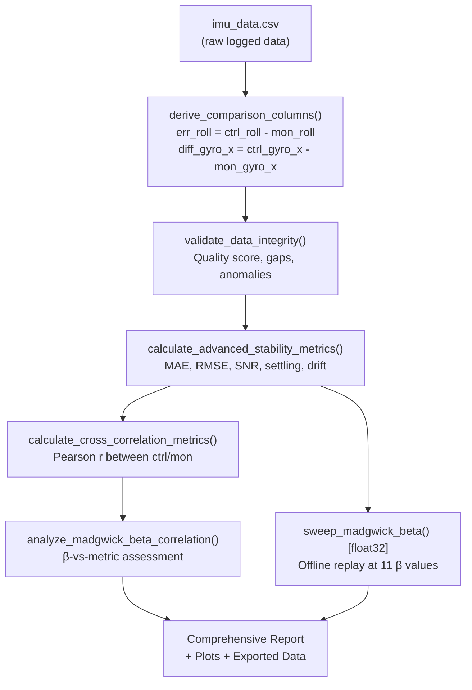
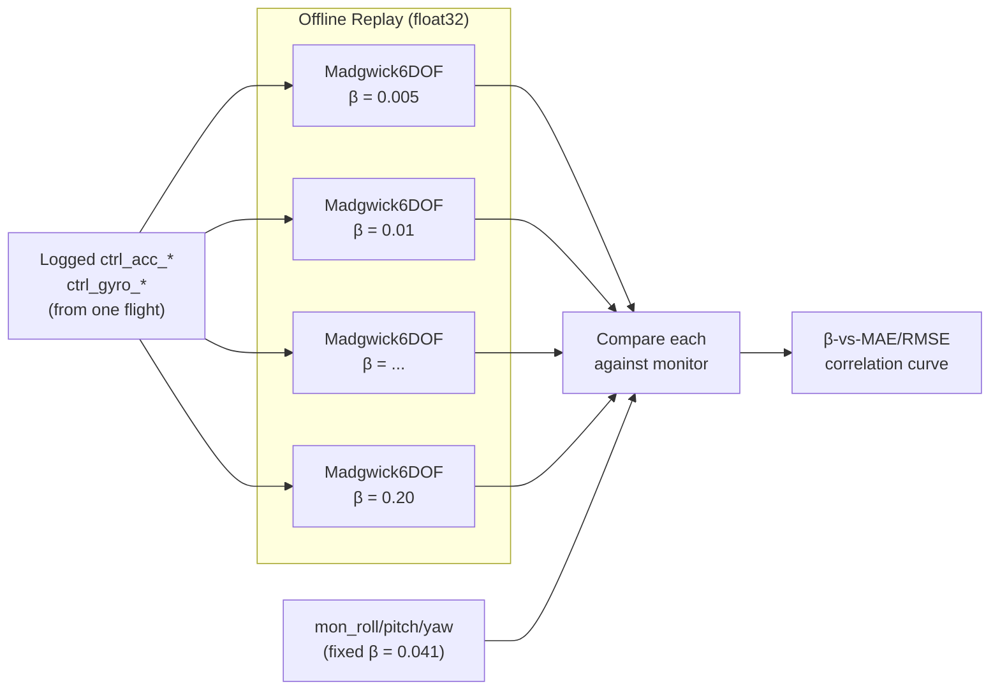
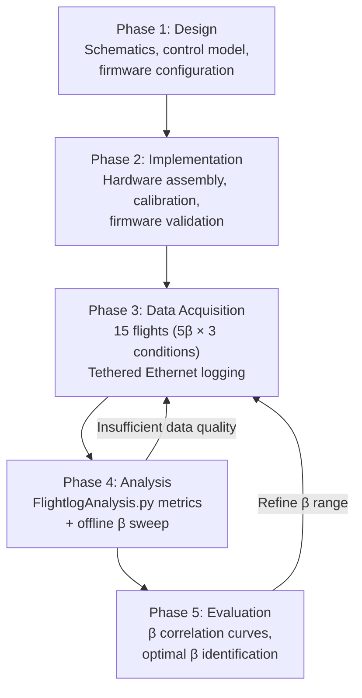

# FCUMCFRP — Research Methodology & Testing Procedure

## Correlation of Madgwick Filter Beta Parameter on Quadrotor Stabilization Metrics

---

## 1. Planning & System Design

### 1.1 Research Objective

Determine the correlation between the Madgwick filter gain parameter (β) and flight stabilization performance metrics (MAE, RMSE, settling time, drift rate) across controlled flight conditions.

### 1.2 System Architecture



### 1.3 Control Model

The Madgwick filter estimates attitude from gyroscope and accelerometer data using gradient descent optimization on a quaternion representation:

**Quaternion rate from gyroscope:**

$$\dot{q}_{gyro} = \frac{1}{2} q \otimes \begin{bmatrix} 0 \\ \omega_x \\ \omega_y \\ \omega_z \end{bmatrix}$$

**Gradient descent correction (6-DOF):**

$$\nabla f = J^T(\hat{q}) \cdot f(\hat{q}, \hat{a})$$

**Filter fusion with beta parameter:**

$$\dot{q}_{est} = \dot{q}_{gyro} - \beta \cdot \frac{\nabla f}{\|\nabla f\|}$$

**Quaternion integration:**

$$q_{t+1} = q_t + \dot{q}_{est} \cdot \Delta t$$

Where **β** controls the trade-off:
- **Low β** (< 0.02): Trusts gyroscope more → fast response, susceptible to drift
- **High β** (> 0.10): Trusts accelerometer more → noise rejection, slower response

### 1.4 PID Control Loop

The estimated attitude feeds into a cascaded PID controller (`controlANGLE2`):

```
                    ┌──────────────┐
roll_des ──────────►│  Outer Loop  │──► roll_rate_des
roll_IMU ──────────►│  (P + I)     │
                    └──────────────┘
                    ┌──────────────┐
roll_rate_des ─────►│  Inner Loop  │──► roll_PID
GyroX ─────────────►│  (P + I + D) │
                    └──────────────┘
```

The β parameter affects `roll_IMU` quality, which propagates through both PID loops to motor commands — making this a **closed-loop** study.

---

## 2. System Implementation

### 2.1 Hardware Configuration

| Component | Specification |
|-----------|--------------|
| **Flight Controller** | Teensy 4.0 (ARM Cortex-M7, 600 MHz) |
| **Control IMU** | MPU6050 — Wire (I2C0), SDA=18/SCL=19, 1 MHz |
| **Monitor IMU** | ICM20948 — Wire1 (I2C1), SDA1=16/SCL1=17, 400 kHz |
| **Receiver** | iBus via Serial3 |
| **ESC Protocol** | OneShot125 (Pins 0-5) |
| **Telemetry** | W5500 Ethernet, SPI (CS=Pin 10), UDP @ 200 Hz |
| **Status LED** | Pin 14 (relocated from Pin 13 to avoid SPI SCK conflict) |

### 2.2 Firmware Configuration (`quad.h`)

```c
#define USE_MPU6050_I2C              // Control IMU
#define USE_ICM20948_MONITOR_I2C     // Monitor IMU (fixed β reference)
#define USE_IBUS_RX                  // Receiver protocol
#define B_MADGWICK_MONITOR 0.041f    // Fixed reference beta
#define MONITOR_UDP_RATE_MS 5        // 200 Hz telemetry
#define USE_MONITOR_ATTITUDE_COMPARISON
#define USE_MANEUVER_SEQUENCE        // Automated test inputs
```

### 2.3 Calibration Procedure

1. Place vehicle on level surface
2. Uncomment `calculate_IMU_error_main()` → flash → capture serial output → paste values → re-comment
3. Uncomment `calculate_IMU_error_monitor()` → same process for monitor IMU
4. Run `calibrateMagnetometerMonitor()` → rotate in all axes → paste hard/soft iron values
5. Verify: both IMUs show ~0° roll/pitch and ~1.0g AccZ at rest

---

## 3. Data Acquisition

### 3.1 Test Matrix



**Total: 15 observed datasets** (5 β × 3 conditions)

### 3.2 Flight Condition Definitions

#### Condition 1: Static Hover (60 s)

| Parameter | Value |
|-----------|-------|
| Duration | 60 seconds |
| Throttle | Hover trim (~1350 PWM) |
| Stick inputs | All neutral (1500 PWM) |
| Purpose | Baseline stability, steady-state noise floor |
| Key metrics | MAE, std dev, drift rate |

#### Condition 2: Sequential Maneuver (~65 s)

Automated via `injectManeuverSequence()`:

| Phase | Time | Command | Purpose |
|-------|------|---------|---------|
| Hover settle | 0–10 s | Neutral | Establish baseline |
| Roll step +15° | 10–20 s | CH2 = 1650 | Step response (roll) |
| Settle | 20–25 s | CH2 = 1500 | Recovery dynamics |
| Pitch step +15° | 25–35 s | CH3 = 1650 | Step response (pitch) |
| Settle | 35–40 s | CH3 = 1500 | Recovery dynamics |
| Yaw step | 40–50 s | CH4 = 1650 | Heading response |
| Combined | 50–60 s | Roll+Pitch | Multi-axis coupling |
| Final settle | 60–65 s | Neutral | Return to baseline |

Key metrics: Settling time (2%, 5%), convergence time, overshoot

#### Condition 3: Disturbance Rejection (5 min)

| Parameter | Value |
|-----------|-------|
| Duration | 300 seconds |
| Throttle | Hover trim |
| Disturbance | Manual stick impulses or physical push at ~30 s intervals |
| Purpose | Rejection performance under unexpected perturbation |
| Key metrics | Peak error, recovery time, event detection count |

### 3.3 Data Collection Workflow



### 3.4 Naming Convention

```
data_logs/
├── b033_hover_20260520_091500/imu_data.csv
├── b033_maneuver_20260520_092000/imu_data.csv
├── b033_disturb_20260520_093000/imu_data.csv
├── b040_hover_20260520_100000/imu_data.csv
├── ...
└── b150_disturb_20260520_140000/imu_data.csv
```

---

## 4. Data Processing & Analysis

### 4.1 Processing Pipeline



### 4.2 Mathematical Formulations

#### 4.2.1 Error Metrics (per axis: roll, pitch, yaw)

**Attitude Error** (derived offline):

$$e_k = \theta_{ctrl,k} - \theta_{mon,k}$$

Where $\theta_{ctrl}$ is the control IMU attitude (variable β) and $\theta_{mon}$ is the monitor IMU attitude (fixed β = 0.041).

**Mean Absolute Error:**

$$\text{MAE} = \frac{1}{N} \sum_{k=1}^{N} |e_k|$$

**Root Mean Square Error:**

$$\text{RMSE} = \sqrt{\frac{1}{N} \sum_{k=1}^{N} e_k^2}$$

**Standard Deviation:**

$$\sigma = \sqrt{\frac{1}{N} \sum_{k=1}^{N} (e_k - \bar{e})^2}$$

**Signal-to-Noise Ratio:**

$$\text{SNR}_{dB} = 10 \cdot \log_{10}\left(\frac{\sigma^2_{signal}}{\sigma^2_{error}}\right)$$

#### 4.2.2 Time-Domain Metrics

**Settling Time** (p% tolerance):

$$T_s(p\%) = \min\{t : |e(t')| < p\% \cdot |e_{ss}|, \quad \forall t' \geq t\}$$

Implemented with a 100-sample sustained window to avoid false detection.

**Convergence Time:**

$$T_c = \min\{t : |e(t)| < 0.1 \cdot |e_{max}|\}$$

**Drift Rate:**

$$\dot{d} = \frac{e(t_{end}) - e(t_{start})}{t_{end} - t_{start}} \quad \text{[°/s]}$$

#### 4.2.3 Frequency-Domain Metrics

**Dominant Frequency** (via FFT):

$$f_{dom} = \arg\max_f |E(f)|, \quad E(f) = \text{FFT}(e_k)$$

Used to detect oscillatory behavior from aggressive β values.

#### 4.2.4 Cross-Correlation

**Pearson Correlation** (ctrl vs mon):

$$r = \frac{\sum (x_i - \bar{x})(y_i - \bar{y})}{\sqrt{\sum (x_i - \bar{x})^2 \sum (y_i - \bar{y})^2}}$$

High $r$ (> 0.95) indicates consistent attitude estimation between IMUs.

### 4.3 Offline Madgwick Beta Sweep (Augmentation)

#### 4.3.1 Purpose

The 15 flight datasets provide **closed-loop** β correlation (β affects PID → motors → physical motion). The offline sweep provides **open-loop** β correlation (same raw sensor data, different β, no physical feedback).

Together, they characterize:
- **Flight data**: How β affects real stabilization performance
- **Sweep data**: How β affects the filter estimation in isolation

#### 4.3.2 Mechanism



#### 4.3.3 Float32 Emulation

The offline replay uses `np.float32` arithmetic throughout to match the Teensy 4.0's single-precision FPU. This ensures the replay's rounding behavior matches the firmware:

- Quaternion state: `dtype=np.float32`
- Constants: `np.float32(0.0174533)`, `np.float32(0.5)`, etc.
- `invSqrt`: `F(1.0) / F(np.sqrt(F(x)))` matching `1.0f/sqrtf(x)`
- Euler conversion: `atan2`/`asin` results cast back to `float32`

#### 4.3.4 Key Difference from Flight Data

| Aspect | Flight Data (15 datasets) | Offline Sweep |
|--------|--------------------------|---------------|
| β effect on | Entire closed-loop system | Filter estimation only |
| Physical motion | Changes with β | Fixed (from one flight) |
| Number of β values | 5 (selected) | 11 (sweep, configurable) |
| Datasets needed | 15 flights | 1 flight |
| Measures | Real stabilization | Filter accuracy |

---

## 5. Evaluation

### 5.1 Expected Outcomes

For each flight condition, plot β versus:
1. **MAE** — expected U-shaped curve (too low = drift, too high = noise lag)
2. **RMSE** — similar shape, weighted toward large errors
3. **Settling Time** — expected monotonic increase with β (slower response)
4. **Drift Rate** — expected decrease with β (more accel correction)
5. **SNR** — expected increase with β up to a plateau

### 5.2 Analysis Deliverables

Per flight condition (3 sets of these):

| Deliverable | Content |
|-------------|---------|
| β-vs-MAE table | 5 β values × 3 axes |
| β-vs-RMSE table | 5 β values × 3 axes |
| β-vs-settling table | 5 β values × 3 axes |
| Time-series overlay | ctrl/mon attitude at each β |
| Frequency spectra | Error FFT at each β |
| Offline sweep curve | 11-point β correlation from single flight |

### 5.3 Evaluation Criteria

| Metric | Excellent | Good | Fair | Poor |
|--------|-----------|------|------|------|
| MAE | < 0.5° | < 1.0° | < 2.0° | > 2.0° |
| RMSE | < 1.0° | < 2.0° | < 4.0° | > 4.0° |
| Data Quality | ≥ 90/100 | ≥ 75/100 | ≥ 60/100 | < 60/100 |
| IMU Correlation | > 0.95 | > 0.90 | > 0.80 | < 0.80 |

### 5.4 Research Workflow Summary



---

> [!NOTE]
> This document is a rough methodology framework. Refine section numbering, add literature references, and expand the system design with actual schematics before submission.
